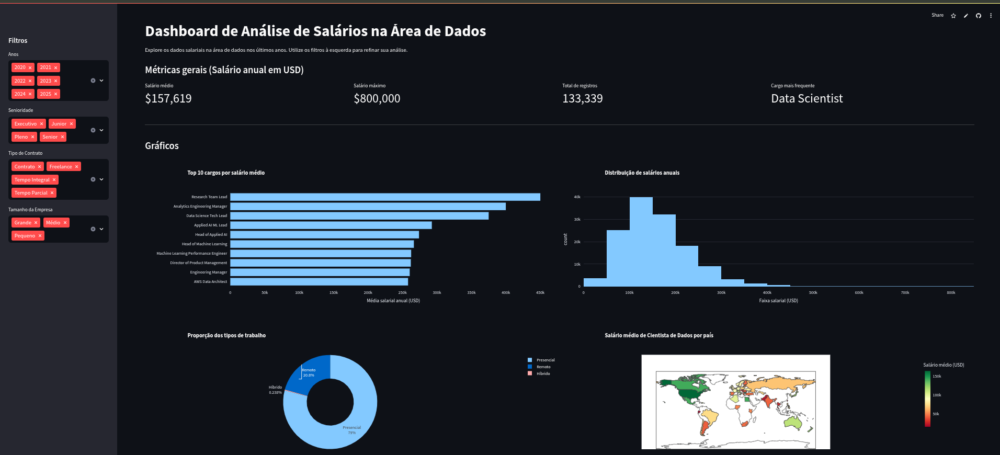

# Imersão Dados com Python - Alura

Este repositório contém os projetos e exercícios desenvolvidos durante a **Imersão Dados com Python 2026** da Alura.

## 🌐 Demo ao Vivo

[](https://aula-4-9harmqmmzxvxtnkjghngyg.streamlit.app/)



## 📚 Sobre a Imersão

A Imersão Dados é um evento gratuito promovido pela Alura que ensina análise de dados com Python através de aulas práticas e projetos reais.

🔗 [Guia de Mergulho - Imersão Dados com Python 2026](https://grupoalura.notion.site/Imers-o-Dados-com-Python-2026-Guia-de-Mergulho-2d9379bdd09b81fe89f8ff4b3f3f4aee)

## ✨ Funcionalidades do Dashboard

- 📊 Visualização interativa de dados salariais na área de tecnologia
- 🔍 Filtros dinâmicos para análise personalizada
- 📈 Gráficos e estatísticas sobre o mercado de dados
- 🎨 Interface responsiva e intuitiva desenvolvida com Streamlit

## 📁 Estrutura do Projeto

```
.
├── Aulas_Imersao_dados_com_Python_Alura.ipynb  # Notebook com as aulas
├── aula-4/                                      # Projeto da Aula 4
│   ├── app.py                                  # Aplicação Streamlit
│   ├── dados-imersao-final.csv                 # Dataset utilizado
│   └── requirements.txt                        # Dependências do projeto
├── imersao.txt                                 # Anotações da imersão
└── README.md                                   # Este arquivo
```

## 🚀 Como Executar

### Notebook Jupyter
```bash
jupyter notebook Aulas_Imersao_dados_com_Python_Alura.ipynb
```

### Aplicação Streamlit (Aula 4)
```bash
cd aula-4
pip install -r requirements.txt
streamlit run app.py
```

> 🌐 **Ou acesse diretamente a [versão hospedada](https://aula-4-9harmqmmzxvxtnkjghngyg.streamlit.app/)**

## 🛠️ Tecnologias Utilizadas

- Python
- Pandas
- Jupyter Notebook
- Streamlit
- Análise de Dados

## 👨‍💻 Autor

Projeto desenvolvido durante as aulas da Imersão Dados com Python da Alura.

---

⭐ Se este repositório foi útil para você, considere dar uma estrela!
